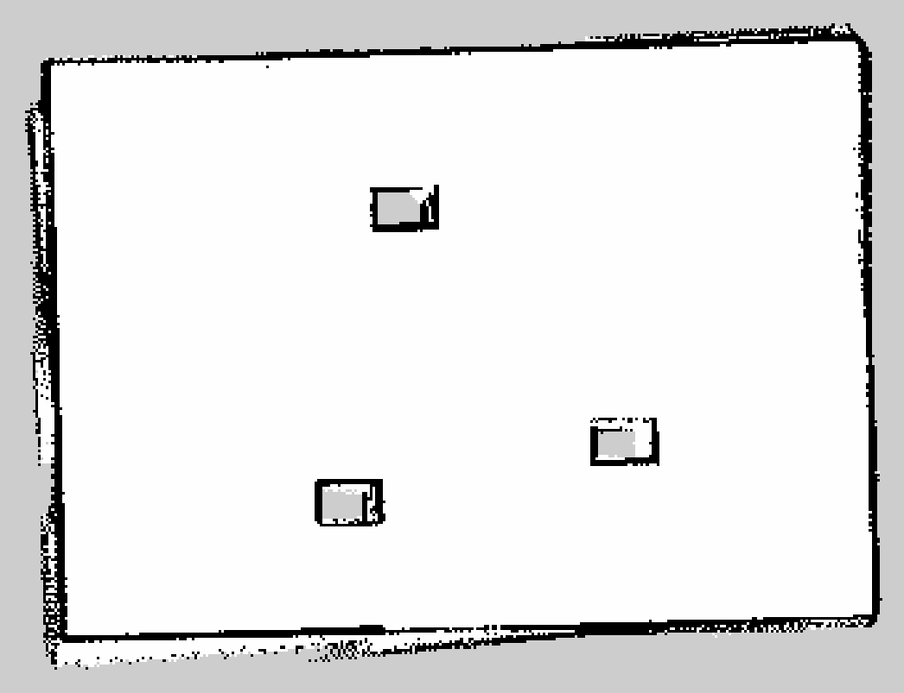

# Install

- Clone the Repository:

```bash
# Clone the Sucky simulation repo
git clone git@github.com:jkoubs/sucky_ws.git
```

- Install Dependencies

```bash
cd ~/sucky_ws
rosdep install --from-paths src --ignore-src -r -y
```

- Build the Workspace

```bash
cd ~/sucky_ws
colcon build --symlink-install
source install/setup.bash
```

- **Tip:** Add this line to your `.bashrc` to source automatically:

```bash
echo "source ~/sucky_ws/install/setup.bash" >> ~/.bashrc
```

# Launch Simulation

## 3D SLAM with RTAB-Map

- Bringup the robot simulation:
```bash
cd ~/sucky_ws/
colcon build
source install/setup.bash
ros2 launch sucky_bringup sim_fcpp_bringup.launch.py
```

-  Launch RTAB-Map:

```bash
cd ~/sucky_ws/
colcon build --packages-select sucky_rtabmap
source install/setup.bash
ros2 launch sucky_rtabmap sim_rtabmap.launch.launch.py
```
 - Teleop the robot around to create the map:
```bash
ros2 run teleop_twist_keyboard teleop_twist_keyboard --ros-args -r /cmd_vel:=/diffbot_base_controller/cmd_vel_uncstamped
```

<div align="center">
  
</div>


- Post map processing with `rtabmap-databaseViewer`:
```bash
rtabmap-databaseViewer ~/.ros/rtabmap.db
```

<div align="center">
  
</div>

From the database you can do some post processing and debugging. You could also **export the 3d point cloud data and the 2d map**.

<div align="center">
  
</div>


<div align="center">
  
</div>

## Full Coverage Path Planning (FCPP)

- Bringup the Full Coverage Path Planning:

```bash
cd ~/sucky_ws/
colcon build
source install/setup.bash
ros2 launch sucky_bringup sim_fcpp_bringup.launch.py
```

- Launch the cleaning visualizer for monitoring cleaning process:

```bash
cd ~/sucky_ws/
colcon build --packages-select sucky_nav
source install/setup.bash
ros2 launch sucky_nav sim_fcpp_visualizers.launch.py
```

<div align="center">
  
</div>

## Opennav Coverage

- Launch teh Coverage Server:

```bash
cd ~/sucky_ws/
colcon build 
source install/setup.bash
ros2 launch sucky_nav sim_coverage_server.launch.py 
```

- Bringup Opennav Coverage:

```bash
cd ~/sucky_ws/
colcon build --packages-select sucky_bringup
source install/setup.bash
ros2 launch sucky_bringup sim_opennav_bringup.launch.py 
```

```bash
cd ~/sucky_ws/
colcon build --packages-select sucky_nav
source install/setup.bash
ros2 run sucky_nav demo_coverage_optimized.py
```

<div align="center">
  
</div>