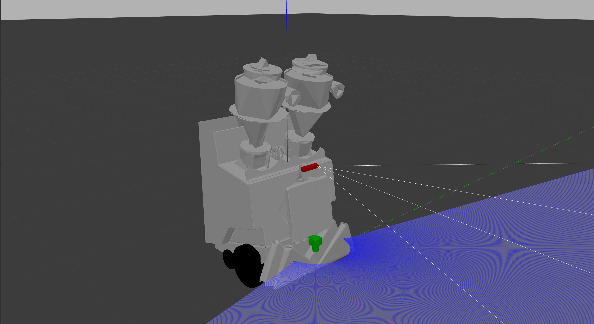
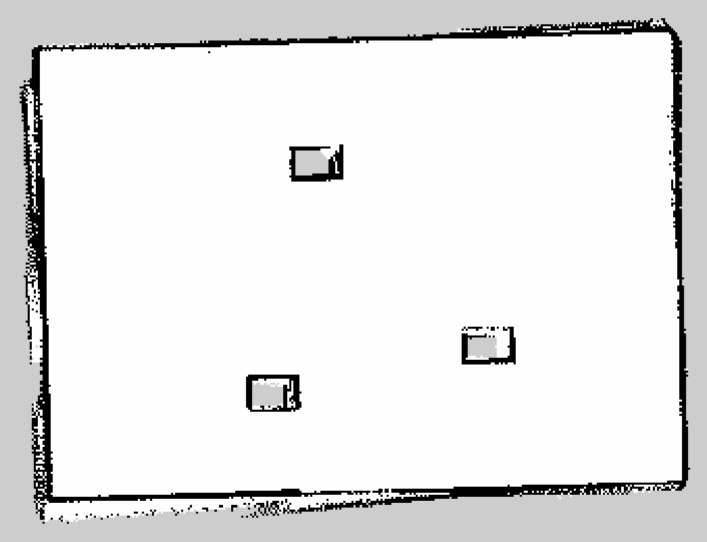

# *Sucky — Autonomous Cleaning Robot Simulation Environment*

  

This repo contains all the **simulation work** for **Sucky**, an autonomous cleaning robot developed during my **summer internship at Hampton Lumber**.  

Looking for the real robot implementation of this project?
You can find it here: [*Sucky — Autonomous Cleaning Robot*](https://github.com/jkoubs/sucky_real_ws).

# Table of Contents
- [About](#about)  
  - [Goals](#goals)  
- [Technical Approach](#technical-approach)  
  - [Simulated Hardware](#simulated-hardware)  
  - [Software Stack](#software-stack)  
  - [Key Contributions](#key-contributions)  
- [Results](#results)  
  - [3D SLAM with RTAB-Map](#3d-slam-with-rtab-map)  
  - [Coverage Planning](#coverage-planning)  
    - [Full Coverage Path Planning](#full-coverage-path-planning)  
    - [Opennav Coverage](#opennav-coverage)  
  - [Dynamic Obstacle Avoidance](#dynamic-obstacle-avoidance)
- [Ideas for Improvement](#ideas-for-improvement)  
- [Acknowledgments](#acknowledgments)  

# About

The Sucky simulation environment provides a virtual platform to replicate the behavior of the real cleaning robot and create a realistic, reliable environment for testing and debugging before deploying to the physical hardware.

By simulating the robot, its sensors, and a realistic environment, we were able to iterate quickly and safely while building a robust foundation for deployment.

## Goals

- Validate navigation, mapping, and obstacle avoidance behaviors before real-world testing.

- Experiment with different coverage planning strategies to identify the most efficient approach.

- Enable safe testing of edge cases, such as dynamic obstacles, without physical risk.

- Provide a development platform for future improvements and new features.

# Technical Approach 

## Simulated Hardware

 - **Drive Base:** Two powered drive wheels combined with two free-spinning mecanum caster wheels for stability.
The robot uses a **differential drive configuration** to control movement, making it simple yet effective for navigating industrial environments like a sawmill.

 - **LiDAR:** Sick TIM781 for accurate and reliable obstacle detection.

 - **Depth Camera:** Intel RealSense D455 equivalent for 3D perception and SLAM.

## Software Stack
 - **Framework:** ROS 2 Humble, RViz.
 - **Simulator:** Gazebo.
 - **Nav2 Stack:** Provides navigation, planning, and autonomous movement.
 - **RTAB-Map:** For 3D mapping.

## Key Contributions

- **3D Mapping:** RTAB-Map implementation combining LiDAR and depth camera data for 3D map creation.

 - **Behavior Trees (BTs):** A custom behavior tree was developed to integrate **SpiralSTC** planning, based on the [Full Coverage Path Planner](https://github.com/nobleo/full_coverage_path_planner) repo from [nobleo](https://github.com/nobleo/full_coverage_path_planner).

- **Coverage Planning:** Implemented and tested systematic cleaning strategies using path coverage algorithms.
**Two solutions were implemented:**

  - [Full Coverage Path Planning (FCPP)](https://github.com/nobleo/full_coverage_path_planner): Primary solution, deployed on the real robot. Added a an **interpolation_resolution** parameter for better fine-tuning.

  - [Opennav Coverage](https://github.com/open-navigation/opennav_coverage): Secondary solution, used for simulation experiments only.

- **Navigation:** Integrated **ROS 2 Nav2** for autonomous navigation and extensively tuned its parameters to achieve smooth and reliable movement in the simulation.
A major focus was on the **controller_server**, where I configured and optimized the [Model Predictive Path Integral (MPPI)](https://docs.nav2.org/configuration/packages/configuring-mppic.html) controller for robust path following and dynamic obstacle handling.

# Results

This section highlights the key outcomes of the simulation work, including 3D mapping, systematic coverage strategies, and dynamic obstacle handling.

For **step-by-step instructions on launching and running the simulations**, please refer to the [Simulation Launch Guide](Instructions.md).

## 3D SLAM with RTAB-Map

  

From this 3D map, we can extract the point cloud data:

  

This 3D map allows us to extract a 2D slice that will serve as the base for navigation:

  

## Coverage Planning

### Full Coverage Path Planning

  

### Opennav Coverage

  

## Dynamic Obstacle Avoidance

  

# Ideas for Improvement

For a more detailed explanation of these improvements, please check [Improvements Report](Improvements.md).

Looking ahead, there are **three primary areas for improvement** that will significantly enhance the system’s performance, robustness, and usability:

- **Enhanced dynamic obstacle avoidance strategy**

- **Integrating Opennav Coverage into the real robot for finer control of coverage areas**

- **Adding higher-level error handling and notification logic**

Some other future enhancements worth exploring with lower priority include:

- **Hose detection pipeline**

- **Automated dumping process**

- **Automated charging**

- **Cleaning progress & robot status dashboard**

# Acknowledgments

I would like to thank **Hampton Lumber** for the opportunity to work on this project and gain hands-on experience in robotics during my internship.

Special thanks to **George Fox University** for developing the physical robot chassis that served as the foundation for this work.

I also want to recognize my fellow interns for their collaboration and contributions:

**Alexander Roller** — Robotics Engineer — [@AlexanderRoller](https://github.com/AlexanderRoller)

**Benjamin Cantero** — Mechanical Lead

**Jason Koubi (myself)** — Robotics Software Developer — [@jkoubs](https://github.com/jkoubs)

Finally, thanks to the open-source community and the following projects, which were essential to this work:

[full_coverage_path_planner](https://github.com/nobleo/full_coverage_path_planner)
 — Main coverage planning solution and SpiralSTC integration.

[opennav_coverage](https://github.com/open-navigation/opennav_coverage)
 — Alternative coverage planning strategy for simulation.